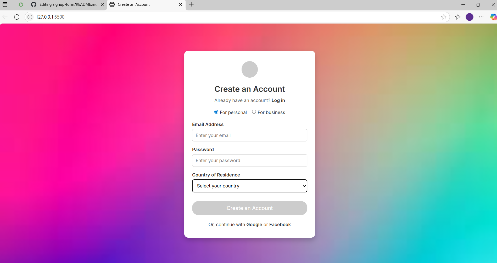
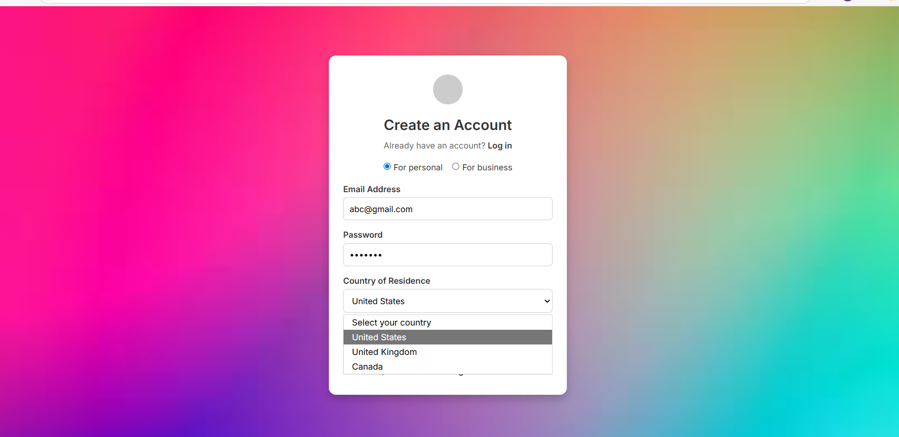

# Signup Form Project

A clean and responsive signup form with a fullscreen background image. Built with HTML and CSS, this project is great for learning basic layout and styling techniques. The UI was first designed in Figma before being implemented in code.

## Features

- Fullscreen background image (bg.jpg)
- Centered form card with modern styling
- Email, Password, and Country of Residence fields
- Radio buttons for account type selection
- Responsive design for different screen sizes

## Project Structure

- `index.html` — HTML markup for the signup form
- `style.css` — CSS styles for layout and design
- `bg.jpg` — Background image

## How to Run

1. Clone or download the repository.
2. Make sure all files are in the same folder.
3. Open `index.html` in your browser.

## Preview

---

Built for practicing clean HTML/CSS layout and responsive design, and for learning UI planning and design using Figma.
